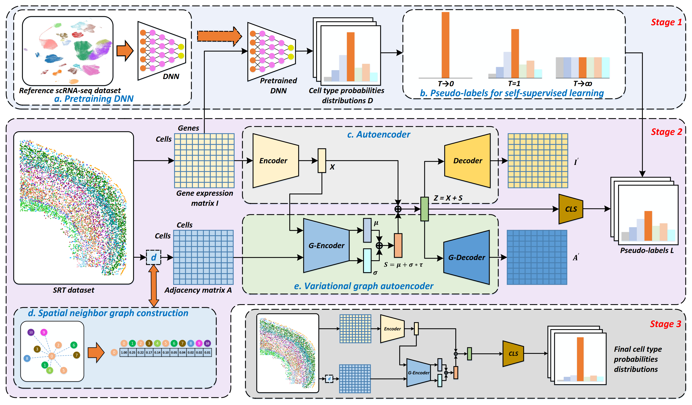

Welcome to Spatial-ID's documentation!
======================================

.. toctree::
   :maxdepth: 2

   installation
   spatialid

Overview
========
Spatially resolved transcriptomics (SRT) provides the opportunity to investigate the gene expression profiles and the spatial context of cells in naive state. Cell type annotation is a crucial task in the spatial transcriptome analysis of cell and tissue biology. In this study, we propose Spatial-ID, a supervision-based cell typing method, for high-throughput cell-level SRT datasets that integrates transfer learning and spatial embedding. Spatial-ID effectively incorporates the existing knowledge of reference scRNA-seq datasets and the spatial information of SRT datasets.

